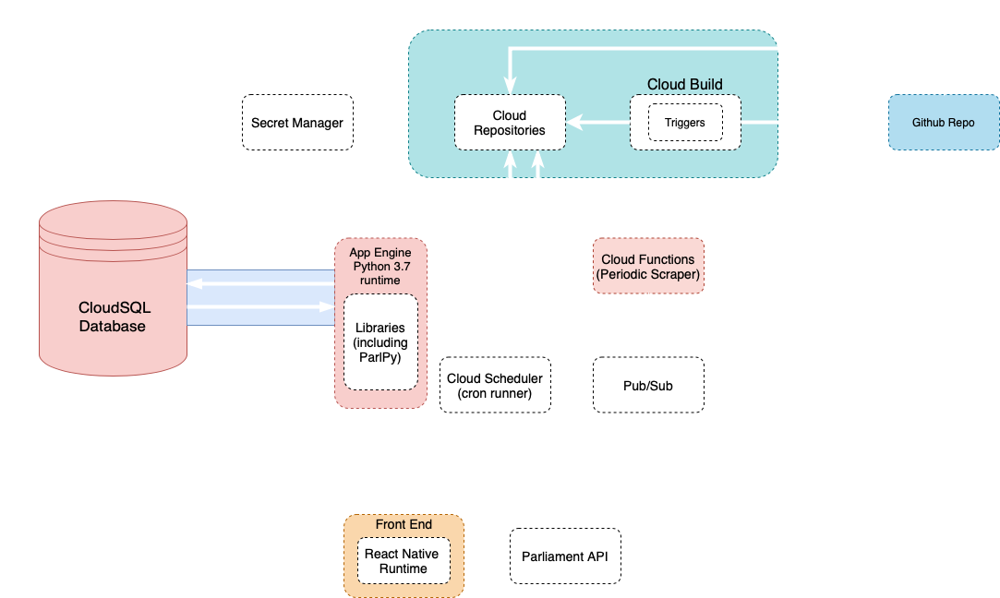

  

# Insight
Server for **Insight**: a Parliamentary Bill tracker, making democracy accessible to everyone.

This is a year-long project in a team of 7, for the *Integrated group-based project* unit at University of Bath 🛁.

## Related Repositories
These repositories hold other parts of our project.

 - [ParlPy](https://github.com/Litharge/ParlPy): An open-source package to scrape and process UK Parliamentary Bills, votes and MP contact information.
 - [mp-app](https://github.com/joedownard/mp-app): Frontend of this project.
 - [ParlPy_executor](https://github.com/alex-and-the-antelopes/ParlPy_executer): Code to put data from ParlPy into the database.
 
## Usage
As this is only a single part of a bigger system, using it on it's own will take some tinkering. 

Here is a HLA diagram of our working system.

## How does it work?
Insight follows both CRUD and REST architectures. ParlPy is run every hour to update our database with bill information, scraped from the Houses of Parliament website. This data is then served as a resource, when requested, following POST requests from the frontend. 

### Notifications
When bills have been updated, notifications are sent to the frontend, using the expo notifications API.

### GCP Secret Manager
To access sensitive information, such as database login credentials, we use Google Cloud Platform's Secret Manager, using our own wrapper-code to access it.
