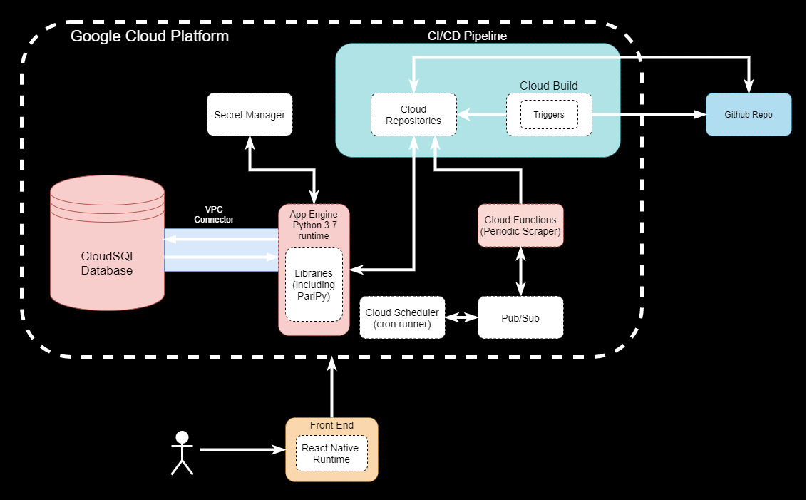

  

# Insight
Server for **Insight**: a Parliamentary Bill tracker, making democracy accessible to everyone.

This is a year-long project in a team of 7, for the *Integrated group-based project* unit at University of Bath 🛁.

## Related Repositories
These repositories hold other parts of our project.

 - [ParlPy](https://github.com/Litharge/ParlPy): An open-source package to scrape and process UK Parliamentary Bills, votes and MP contact information.
 - [mp-app](https://github.com/joedownard/mp-app): Frontend of this project.
 - [ParlPy_executor](https://github.com/alex-and-the-antelopes/ParlPy_executer): Code to put data from ParlPy into the database.
 
## Usage
As this is only a single part of a bigger system, using it on it's own will take some tinkering. 

Here is a HLA diagram of our working system.

## How does it work?
Insight follows both CRUD and REST architectures. ParlPy is run every hour to update our database with bill information, scraped from the Houses of Parliament website. This data is then served as a resource, when requested, following POST requests from the frontend. 

### Notifications
When bills have been updated, notifications are sent to the frontend, using the expo notifications API.

### GCP Secret Manager
To access sensitive information, such as database login credentials, we use Google Cloud Platform's Secret Manager, using our own wrapper-code to access it.

## Security
- Use a SSL Certificate provided by Google which allows us to establish a secure connection between the different components of our application.

- Token-based authentication protocol.

- Passwords are hashed before storing (PBKDF2).

- Email alerts on signup and when a user logs in.

## Legal, Ethical and Moral
This code is publically available under the GNU General Public License v3.0. As such, it is provided with **no liability or warranty**: just because our usage of this code is legal, doesn't mean that all usages are.

GDPR Article 9, Paragraph 1 prohibits processing of data "revealing political opinions", unless certain criteria are met. However, we take measures to ensure these criteria are met.

Regarding collection of user data, GDPR states that Article 9, Paragraph 1 does not apply when "the data subject has given explicit consent to the processing of those personal data for one or more specified purposes". Therefore, when the user signs up for an account, they are presented with a terms of use dialogue box that they must agree to in order to sign up. 

We also store data revealing the political opinions of MPs, who GDPR still applies to. We do not gain the consent of MPs, however GDPR also states that Article 9, Paragraph 1 does not apply if the data is made "manifestly public". Therefore as the data we present is scraped from a public government website and collected from a public API, consent is not required.

The remainder of the information that we gather from the UK Parliamentary sites and APIs is licensed under the [Open Parliament License](https://www.parliament.uk/site-information/copyright-parliament/open-parliament-licence/), which allows us to “exploit the information… by including it in our own application”

We believe that our collection of data is ethical and not excessive, as well as being kept securely. We present publicly only data that is already publicly available, or else is anonymised.

The aim of this project is to make politics accessible for everyone, and is done so in a fair and legal way. We do not collect unnecessary data or exploit trust from the users or MPs.
